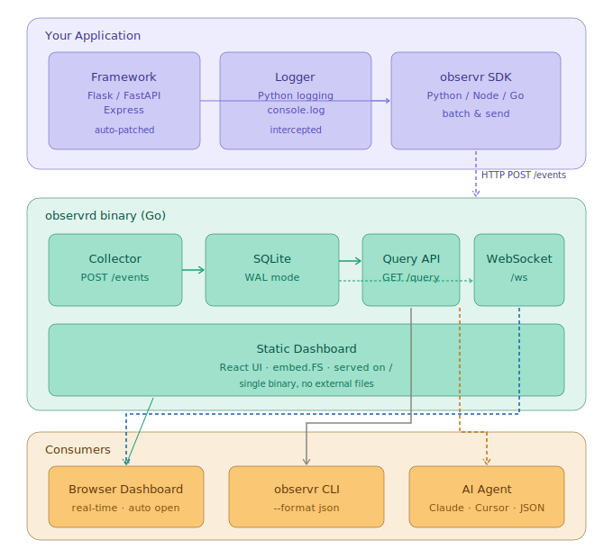

# observr

> Zero-config observability for local & on-prem services — built for AI agents.

```python
import observr
observr.init(service="my-api")  # HTTP tracing + structured logs + live dashboard. Done.
```

---

## Why observr?

| | Datadog / Grafana | OpenTelemetry | **observr** |
|---|---|---|---|
| Setup | Very complex | Complex | **1 line** |
| Local / on-prem | Paid | Self-host required | **Default** |
| AI agent friendly | No | No | **Designed for it** |
| Browser dashboard | Separate install | None | **Auto-opens** |
| Cost | Expensive | Free but complex | **Free & open-source** |

Most observability tools are built for ops teams managing cloud infrastructure. **observr is built for developers** — and for the AI agents that help them.

---

## Quickstart

### 1. Start the collector

**macOS / Linux (recommended)**
```bash
curl -sSL https://raw.githubusercontent.com/ydking0911/observr/main/scripts/install.sh | sh
observrd   # → http://localhost:7676 (opens automatically)
```

**Homebrew**
```bash
brew tap ydking0911/observr
brew install observr
```

**go install**
```bash
go install github.com/ydking0911/observr/server/cmd/observrd@latest
```

**Build from source**
```bash
git clone https://github.com/ydking0911/observr
cd observr && make build
./server/bin/observrd
```

### 2. Install the Python SDK

```bash
pip install observr
```

### 3. Instrument your app

Import your framework **before** calling `observr.init()` so auto-detection works.

**FastAPI**
```python
from fastapi import FastAPI
import observr

observr.init(service="my-api")  # auto-detects FastAPI
app = FastAPI()

@app.get("/users")
async def get_users():
    return {"users": []}
```

**Flask**
```python
from flask import Flask
import observr

observr.init(service="my-api")  # auto-detects Flask
app = Flask(__name__)

@app.route("/users")
def get_users():
    return {"users": []}
```

**Logs are captured automatically:**
```python
import logging
logger = logging.getLogger(__name__)
logger.error("Payment failed", extra={"user_id": "u_123", "amount": 9900})
# → Appears in dashboard + queryable via CLI
```

**Manual spans:**
```python
with observr.get_client().span("db.query", table="users") as span:
    rows = db.execute("SELECT ...")
    span.set_attribute("row_count", len(rows))
```

### 4. Query from your AI agent

```bash
# Recent errors as JSON (for Claude Code, Cursor, etc.)
./server/bin/observrd query --level error --last 100

# Filter by HTTP path
./server/bin/observrd query --path /checkout --format json

# Follow a specific trace
./server/bin/observrd query --trace-id 4f2a1b3c

# Plain-text table
./server/bin/observrd query --format text
```

Example (Claude Code):
```
User: Why is the /checkout endpoint slow?
Claude: Let me check the traces...
$ observrd query --path /checkout --last 50 --format json
→ p99 latency: 3200ms, bottleneck: db.query at checkout.py:142
```

---

## Configuration

```python
observr.init(
    service="my-api",                          # service name in dashboard
    collector_url="http://localhost:7676",      # default
    auto_instrument=True,                      # auto-detect Flask / FastAPI
    log_level="DEBUG",                         # minimum log level to capture
)
```

---

## Architecture



### Event Schema

```json
{
  "id": "evt_1711234567890",
  "trace_id": "4f2a1b3c8e9d0f1a",
  "span_id": "a1b2c3d4",
  "service": "my-api",
  "timestamp": "2026-03-24T12:34:56.789Z",
  "type": "http_request",
  "level": "error",
  "method": "POST",
  "path": "/checkout",
  "status_code": 500,
  "duration_ms": 3241.5,
  "message": "POST /checkout",
  "attributes": {
    "query_string": "",
    "client": ["127.0.0.1", 54321]
  }
}
```

---

## Development

```bash
# Build everything (dashboard embedded into binary)
make build

# Run server in dev mode
make dev-server      # Go server on :7676
make dev-dashboard   # Vite dev server on :5173 (proxies to :7676)

# Tests
make test            # Go (16 tests) + Python (11 tests)
make test-e2e        # Full end-to-end test

# Lint
make lint
```

---

## Roadmap

| Version | Status | Features |
|---------|--------|----------|
| **v0.1** | ✅ Done | Python SDK · Go collector · React dashboard · CLI · CI/CD |
| v0.2 | Planned | Node.js SDK · PyPI publish · Homebrew tap |
| v0.3 | Planned | Slack/Discord alerts · Error pattern detection |
| v0.4 | Planned | AI auto-analysis · Multi-service tracing · Go SDK |

---

## Directory Structure

```
observr/
├── sdk/python/          # Python SDK (zero dependencies)
├── server/              # Go collector binary (observrd)
│   ├── cmd/observrd/    # main + CLI subcommands
│   └── internal/        # collector, storage, query, dashboard
├── dashboard/           # Vite + React dashboard (embedded into binary)
├── scripts/             # e2e test script
└── docs/                # Architecture notes
```

---

## License

MIT — see [LICENSE](LICENSE)
