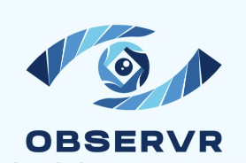

<p align="right">
  <strong>English</strong> | <a href="./README.ko.md">한국어</a>
</p>

<p align="center">
  <br/>
  
  <br/>
</p>

<p align="center">
  <strong>Your AI agent acted. But why?</strong>
  <br/>
  <sub>Audit trail and causal attribution for AI agents — one line to instrument</sub>
</p>

<p align="center">
  <a href="https://github.com/ydking0911/observr/actions/workflows/ci.yml"></a>
  <a href="https://pypi.org/project/observr/"></a>
  <a href="https://www.npmjs.com/package/@ydking0911/observr"></a>
  <a href="server/go.mod"></a>
  <a href="LICENSE"></a>
</p>

<p align="center">
  <a href="#the-problem">Problem</a> ·
  <a href="#why-observr">Why</a> ·
  <a href="#core-concepts">Concepts</a> ·
  <a href="#quickstart">Quickstart</a> ·
  <a href="#query-the-audit-log">Query</a> ·
  <a href="#roadmap">Roadmap</a>
</p>

```python
import observr
observr.init(service="my-agent")
# Every action this agent takes is now recorded and traceable.
```

---

## The Problem

- Your AI agent did something unexpected — you don't know **which decision caused it**
- Three agents are chained together — you can't tell **where the failure started**
- Claude Code or Cursor made a tool call — you want to **review it after the fact**
- An agent threw an error — you need to know **what prior action led to it**

observr answers these questions.

---

## Why observr?

|  | DIY Logging | Datadog / Grafana | **observr** |
|--|:-----------:|:-----------------:|:-----------:|
| Agent causal chain | Manual | ✗ | **Automatic** |
| Decision traceback | Manual | ✗ | **Built-in** |
| Behavioral patterns | Manual | Partial | **Built-in** |
| Setup complexity | High | Very high | **1 line** |
| Local / on-prem | Manual | Paid | **Default** |
| AI agent native | ✗ | ✗ | **Designed for it** |
| Cost | Dev time | Expensive | **Free & open-source** |

---

## Core Concepts

<details>
<summary><strong>Causal Attribution — trace any outcome back to its root</strong></summary>

Every span carries a `parent_span_id` that links it to the action that triggered it. Use `agent_span()` / `agentSpan()` to attach standard observability keys (`intent`, `trigger`, `model`, `tool`) — nesting automatically threads the causal chain.

```python
# Python — context propagation is automatic when spans are nested
client = observr.get_client()
with client.agent_span("agent.decide", intent="answer user", model="claude-sonnet-4-6") as root:
    with client.agent_span("tool.call", trigger=root.span_id, tool="web_search") as child:
        results = web_search("relevant context")
        child.set_attribute("result_count", len(results))
```

```
trace_id: 4f2a1b3c
├── agent.decide   (a1b2)  intent="answer user"  model="claude-sonnet-4-6"
│   └── tool.call  (c3d4, parent: a1b2)  tool="web_search"  result_count=12
```

```ts
// Node.js
await client.agentSpan("agent.decide", { intent: "answer user", model: "claude-sonnet-4-6" })
  .run(async (root) => {
    await client.agentSpan("tool.call", { trigger: root.spanId, tool: "web_search" })
      .run(async () => { /* causally linked — parent_span_id set automatically */ });
  });
```

Click any **trace chip** in the dashboard to open the causality tree — a waterfall showing every span, its duration, and agent attributes.

</details>

<details>
<summary><strong>Behavioral Patterns — signal over noise</strong></summary>

observr normalizes event messages and groups similar ones by fingerprint.

`"Payment failed for user abc123"` and `"Payment failed for user xyz789"` collapse into the same pattern — so you see **frequency over time**, not noise.

</details>

<details>
<summary><strong>Audit Log — local, queryable, persistent</strong></summary>

All events are stored locally in SQLite (WAL mode) with full timestamps, service attribution, and structured attributes.

Queryable by: level · service · trace ID · time range · HTTP path

</details>

---

## Quickstart

### 1. Start the collector

**macOS / Linux**
```bash
curl -sSL https://raw.githubusercontent.com/ydking0911/observr/main/scripts/install.sh | sh
observrd   # → http://localhost:7676
```

**Homebrew**
```bash
brew tap ydking0911/observr && brew install observr
```

**go install**
```bash
go install github.com/ydking0911/observr/server/cmd/observrd@latest
```

### 2. Install the SDK

```bash
pip install observr               # Python
npm install @ydking0911/observr   # Node.js
```

### 3. Instrument your agent

**Python — FastAPI / Flask / Django (WSGI + ASGI)**
```python
import observr
observr.init(service="my-agent")  # auto-detects the framework
# Django: X-Trace-Id / X-Span-Id headers are propagated automatically
```

**Node.js — Express**
```js
const { init } = require('@ydking0911/observr')
init({ service: 'my-agent' })
```

**Agent spans — causal chain with standard attribute keys:**
```python
client = observr.get_client()
with client.agent_span("tool.call", intent="find recent papers", tool="web_search") as span:
    results = web_search("observability 2026")
    span.set_attribute("result_count", len(results))
```

**Logs are captured automatically:**
```python
import logging
logger = logging.getLogger(__name__)
logger.error("Payment failed", extra={"user_id": "u_123", "amount": 9900})
```

---

## Query the Audit Log

```bash
# Recent errors as JSON
observrd query --level error --last 100 --format json

# All actions from a specific agent
observrd query --service my-agent --last 500 --format json

# Trace a full decision tree
observrd query --trace-id 4f2a1b3c

# Export for review
observrd query --level error --last 10000 --format csv > audit.csv

# Human-readable table
observrd query --format text
```

**Example — an AI agent auditing itself:**
```
User: What errors did the agent produce in the last hour?
Claude: Let me pull the audit trail...
$ observrd query --service my-agent --level error --last 200 --format json
→ 3 errors, all traced to span "tool.call" → parent "agent.decide" at 14:32:01
→ Root cause: agent.decide passed malformed input to tool.call
```

---

## Alerts

Fire Slack or Discord notifications when error thresholds are exceeded:

```bash
observrd start \
  --alert-slack-url   https://hooks.slack.com/services/... \
  --alert-discord-url https://discord.com/api/webhooks/... \
  --alert-level       error \
  --alert-threshold   5 \
  --alert-window      60s \
  --alert-cooldown    5m
```

---

## Event Schema

```json
{
  "id":             "evt_1711234567890",
  "trace_id":       "4f2a1b3c8e9d0f1a",
  "span_id":        "a1b2c3d4",
  "parent_span_id": "9f8e7d6c",
  "service":        "my-agent",
  "timestamp":      "2026-03-24T12:34:56.789Z",
  "type":           "span",
  "level":          "error",
  "duration_ms":    3241.5,
  "message":        "tool.call failed",
  "attributes": {
    "tool":  "web_search",
    "error": "timeout after 3000ms"
  }
}
```

`parent_span_id` links a span to its causal parent, enabling full decision tree reconstruction.

---

## Roadmap

| Version | Status | Features |
|---------|:------:|----------|
| **v0.1** | ✅ | Python SDK · Go collector · React dashboard · CLI · CI/CD |
| **v0.2** | ✅ | Node.js SDK · PyPI publish · npm publish |
| **v0.3** | ✅ | Slack/Discord alerts · Event retention (TTL) · JSON/CSV export |
| **v0.4** | ✅ | Causal attribution (`parent_span_id`) · Behavioral pattern detection · Fastify support |
| **v0.5** | ✅ | `agent_span()` / `agentSpan()` helper · Dashboard causality tree view · Django support |
| **v0.6** | ✅ | Deep behavioral pattern analysis — temporal trends, anomaly detection, agent-attribute grouping (`intent`/`tool`/`model`), causal pattern correlation, dashboard Patterns view |
| **v0.7** | 📋 | Audit report generation · Causal chain export (JSON-LD) · Policy rule engine |
| **v0.8** | 📋 | Go SDK · On-chain anchoring · Multi-agent tracing |

---

## Development

```bash
make build          # build everything (dashboard embedded into binary)
make dev-server     # Go server on :7676
make dev-dashboard  # Vite dev server on :5173 (proxies to :7676)
make test           # Go + Python + Node.js
make test-e2e       # full end-to-end test
make lint
```

See [CONTRIBUTING.md](CONTRIBUTING.md) to get started.

---

<p align="center">
  <sub>MIT License · <a href="LICENSE">LICENSE</a></sub>
</p>
