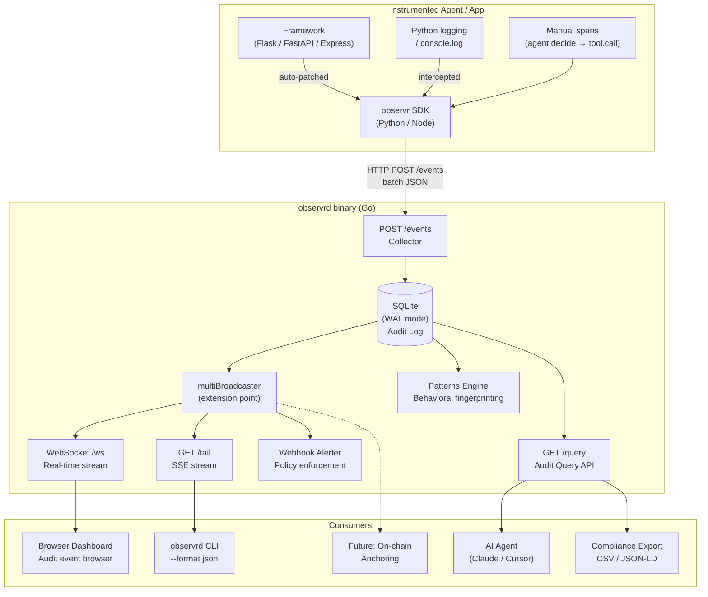

# observr Architecture

## Purpose

observr is an open-source audit trail and accountability layer for AI agents. The core question it answers is: **what did this agent do, and why?**

Every event carries enough context (service identity, timestamp, causal parent, structured attributes) to reconstruct a complete decision tree after the fact — even across multiple agents and services. The goal is developer-first adoption: easy to instrument, easy to query, easy to contribute to.

---

## System Overview



---

## Audit Data Flow

```
Agent takes action
  → SDK creates span with parent_span_id (links to causal parent)
  → SDK enqueues event (non-blocking, 10k queue)
  → Background thread batches + POSTs to :7676/events
  → Collector validates + inserts into SQLite
  → multiBroadcaster fans out to WebSocket / SSE / alerter
  → Patterns engine fingerprints the message for behavioral grouping
```

---

## Causal Attribution

The `parent_span_id` field is the audit chain mechanism. When an agent action causes a subsequent action, the child span carries the parent's `span_id`. This allows full reconstruction of the decision tree:

```
trace_id: 4f2a1b3c
├── span: agent.decide        (span_id: a1b2)
│   ├── span: tool.call       (span_id: c3d4, parent: a1b2)  ← caused by agent.decide
│   │   └── span: web_search  (span_id: e5f6, parent: c3d4)  ← caused by tool.call
│   └── span: db.query        (span_id: g7h8, parent: a1b2)  ← caused by agent.decide
```

Query the full tree: `observrd query --trace-id 4f2a1b3c --format json`

---

## Component Breakdown

### SDK (Python)

```
sdk/python/observr/
├── __init__.py          init(), get_client()
├── _client.py           ObservrClient — lazy import hook, lifecycle, span(), agent_span()
├── _transport.py        Background thread, 10k queue, HTTP batch POST
├── _logger.py           logging.Handler — captures all log records
├── _span.py             Manual span context manager; carries parent_span_id via ContextVar
└── integrations/
    ├── flask.py         before_request / after_request hooks
    ├── fastapi.py       ASGI middleware, monkey-patches FastAPI.__init__
    └── django.py        WSGI middleware
```

`agent_span(name, *, intent, trigger, model, tool, **extra)` — thin wrapper over `span()` that pre-populates standard agent attribute keys. Keys are omitted when `None`; extra kwargs pass through as arbitrary attributes.

### SDK (Node.js)

```
sdk/node/src/
├── index.ts        Public API — init(), Span
├── transport.ts    fetch() + AbortSignal.timeout(3000), unref() timer
├── span.ts         Async span: new Span(name, transport, attrs, parentSpanId)
├── client.ts       ObservrClient — span(), agentSpan()
├── logger.ts       console.log/warn/error patch
└── integrations/
    └── express.ts  Express middleware
```

`agentSpan(name, { intent?, trigger?, model?, tool?, ...extra })` — same contract as Python's `agent_span()`. Destructures standard keys, passes remainder as arbitrary attributes.

### Collector Server (Go)

```
server/
├── cmd/observrd/main.go           Entry point; wires multiBroadcaster
└── internal/
    ├── collector/handler.go       POST /events — decode batch + insert
    ├── storage/store.go           SQLite CRUD; Broadcaster interface definition
    ├── patterns/patterns.go       Normalize() + Fetch() — behavioral fingerprinting
    ├── webhook/alerter.go         Broadcaster impl; threshold alerting → Slack/Discord
    ├── query/query.go             GET /query — filter + format (JSON/CSV/text)
    ├── tail/tail.go               GET /tail — SSE hub, filters level/service/type
    └── dashboard/hub.go           WebSocket hub; embeds React SPA
```

### `Broadcaster` — Audit Sink Extension Point

`storage.Broadcaster` is the interface for anything that consumes events in real time. The `multiBroadcaster` in `main.go` fans out to all registered sinks. New audit outputs (on-chain anchoring, SIEM integrations, compliance exporters) implement this interface and require zero changes to existing code.

```go
type Broadcaster interface {
    Broadcast(e Event)
}
```

Current sinks: `dashboard.Hub` (WebSocket), `tail.Hub` (SSE), `webhook.Alerter` (Slack/Discord).
Planned: `blockchain.Anchorer` (Merkle-hash batch → L2 chain).

### Patterns Engine

`patterns.Normalize()` strips variable tokens from event messages:
- UUIDs → `<uuid>`
- IPs → `<ip>`
- Hex strings → `<hex>`
- Integers → `<N>`

This makes behaviorally identical events (e.g., "Payment failed for user abc123" and "Payment failed for user xyz789") group into the same fingerprint. `patterns.Fetch()` returns grouped patterns sorted by frequency — the foundation for audit reports.

---

## Storage Schema

```sql
CREATE TABLE events (
    id          TEXT PRIMARY KEY,
    trace_id    TEXT,
    span_id     TEXT,
    parent_span_id TEXT,              -- causal attribution chain
    service     TEXT NOT NULL,
    timestamp   TEXT NOT NULL,        -- RFC3339Nano UTC
    type        TEXT NOT NULL,        -- http_request | log | span
    level       TEXT NOT NULL,        -- error | warn | info | debug
    method      TEXT,
    path        TEXT,
    status_code INTEGER,
    duration_ms REAL,
    message     TEXT,
    attributes  TEXT                  -- JSON blob
);
-- Indexes: level, trace_id, timestamp, path
```

---

## Audit Event Schema

```json
{
  "id":             "evt_1711234567890",
  "trace_id":       "4f2a1b3c8e9d0f1a",
  "span_id":        "a1b2c3d4",
  "parent_span_id": "9f8e7d6c",
  "service":        "my-agent",
  "timestamp":      "2026-03-24T12:34:56.789Z",
  "type":           "span",
  "level":          "error",
  "duration_ms":    3241.5,
  "message":        "tool.call failed",
  "attributes": {
    "tool":  "web_search",
    "error": "timeout after 3000ms"
  }
}
```

`parent_span_id` is optional. When set, it links this span to its causal parent, enabling decision tree reconstruction across nested agent actions and services.

---

## Dashboard (React + Vite)

```
dashboard/src/
├── App.tsx               Layout, stats computation, filter + trace state
├── types.ts              ObservrEvent (incl. parent_span_id), Stats, Pattern
├── hooks/
│   ├── useEventStream.ts WebSocket + HTTP initial load
│   ├── usePatterns.ts    Polled pattern fetch (/patterns)
│   └── useTraceEvents.ts Fetch all spans for a trace_id (/query?trace_id=…)
└── components/
    ├── MetricCard.tsx     p50/p99/RPS/error count cards
    ├── FilterBar.tsx      Level tabs + search input + export
    ├── EventTable.tsx     Audit event list; trace chip opens TracePanel
    ├── EventDetail.tsx    Slide-in detail panel (raw event attributes)
    ├── TracePanel.tsx     Causality tree: waterfall + agent attribute badges
    ├── PatternCard.tsx    Behavioral pattern summary card
    ├── LevelBadge.tsx     ERROR / WARN / INFO / DEBUG pill
    └── StatusDot.tsx      Live / Disconnected indicator
```

**TracePanel** builds a tree from `parent_span_id → span_id` links and renders a waterfall: each span's bar starts at `timestamp - duration_ms` (SDK emits at completion) and is proportional to the trace total duration. Agent attribute badges (`intent`, `trigger`, `model`, `tool`) appear below each span row.

---

## Design Decisions

| Decision | Rationale |
|----------|-----------|
| Go single binary | Zero-dependency install. SQLite + web server + CLI in one file |
| SQLite + WAL | Local/on-prem first. No external database. Immutable append-friendly |
| `parent_span_id` in schema | Enables causal attribution without a separate graph store |
| `Broadcaster` interface | Decouples audit sinks — on-chain anchoring adds zero existing code changes |
| Patterns engine | Behavioral fingerprinting needed for compliance reports, not just debugging |
| Python zero-deps SDK | `pip install observr` just works in any agent environment |
| Background queue transport | Audit capture must never block the instrumented agent |
| WebSocket + HTTP fallback | Real-time dashboard; structured JSON for AI agents and compliance scripts |

---

## Roadmap: Audit Features

| Version | Status | Features |
|---------|:------:|----------|
| **v0.4** | ✅ | Causal attribution (`parent_span_id`) · Behavioral pattern detection · Django / Fastify support |
| **v0.5** | 🚧 | `agent_span()` / `agentSpan()` helper · Dashboard causality tree view (TracePanel waterfall) |
| **v0.6** | 📋 | Audit report generation · Accountability chain export (full trace tree as JSON-LD) · Policy rule engine |
| **v0.7** | 📋 | Compliance export (EU AI Act / SOC2) · On-chain anchoring (`blockchain.Anchorer` via `Broadcaster`) · Go SDK |
