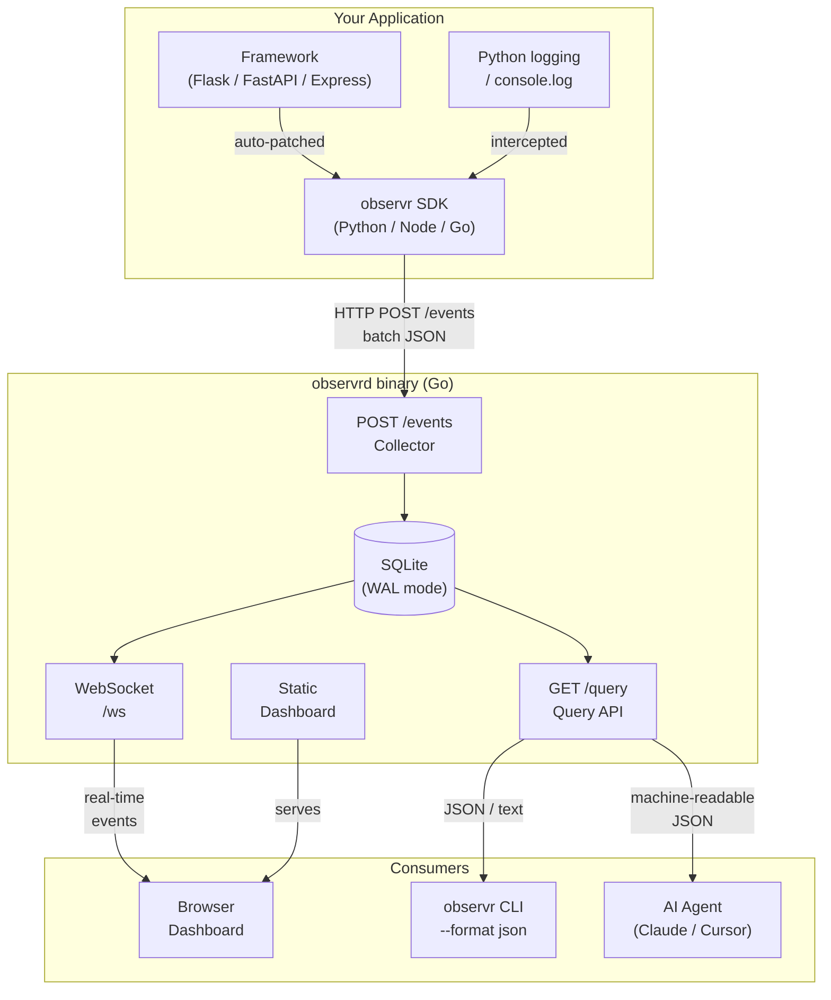

# observr Architecture

## System Overview



---

## Component Breakdown

### SDK (Python — v0.1)

```
observr/
├── __init__.py          init(), get_client()
├── _client.py           ObservrClient — wires everything together
├── _transport.py        Background thread, queue, HTTP batch POST
├── _logger.py           logging.Handler — captures all log records
├── _span.py             Manual span context manager
└── integrations/
    ├── flask.py         before_request / after_request hooks
    └── fastapi.py       ASGI middleware, monkey-patches FastAPI.__init__
```

**Data flow:**

```
HTTP request arrives
  → Flask/FastAPI middleware starts timer, sets trace_id
  → Handler runs
  → Middleware ends timer, calls transport.send(event)
  → Transport enqueues (non-blocking)
  → Background thread batches and POSTs to :7676/events
```

### Collector Server (Go)

```
server/
├── cmd/observrd/main.go          Entry point, CLI subcommands
└── internal/
    ├── collector/handler.go      POST /events — decode + insert
    ├── storage/store.go          SQLite CRUD, Broadcaster interface
    ├── query/query.go            GET /query — filter + format
    └── dashboard/hub.go          WebSocket hub, embed dist/*
```

**Storage schema:**

```sql
CREATE TABLE events (
    id          TEXT PRIMARY KEY,
    trace_id    TEXT,
    span_id     TEXT,
    service     TEXT NOT NULL,
    timestamp   TEXT NOT NULL,       -- RFC3339Nano UTC
    type        TEXT NOT NULL,       -- http_request | log | span
    level       TEXT NOT NULL,       -- error | warn | info | debug
    method      TEXT,
    path        TEXT,
    status_code INTEGER,
    duration_ms REAL,
    message     TEXT,
    attributes  TEXT                 -- JSON blob
);
-- Indexes: level, trace_id, timestamp, path
```

### Dashboard (React + Vite)

```
dashboard/src/
├── App.tsx              Layout, stats computation, filter state
├── types.ts             ObservrEvent, Stats interfaces
├── hooks/
│   └── useEventStream.ts   WebSocket + HTTP initial load
└── components/
    ├── MetricCard.tsx       p50/p99/RPS/error count cards
    ├── FilterBar.tsx        Level tabs + search input
    ├── EventTable.tsx       Main event list with click-to-expand
    ├── EventDetail.tsx      Slide-in detail panel
    ├── LevelBadge.tsx       ERROR / WARN / INFO / DEBUG pill
    └── StatusDot.tsx        Live / Disconnected indicator
```

### CLI Query Interface

For AI agent consumption:

```bash
# Structured JSON output
observr query --last 100 --level error --format json

# Filter by HTTP path
observr query --path /checkout --last 50

# Filter by trace ID
observr query --trace-id 4f2a1b3c

# Plain text for humans
observr query --last 20 --format text
```

---

## Event Schema

```json
{
  "id":          "evt_1234567890",
  "trace_id":    "4f2a1b3c9d8e7f6a",
  "span_id":     "a1b2c3d4",
  "service":     "my-api",
  "timestamp":   "2026-03-24T12:34:56.789Z",
  "type":        "http_request",
  "level":       "error",
  "method":      "POST",
  "path":        "/checkout",
  "status_code": 500,
  "duration_ms": 3241.5,
  "message":     "POST /checkout",
  "attributes": {
    "query_string": "",
    "remote_addr":  "127.0.0.1",
    "exception":    "DatabaseConnectionError: timeout after 3000ms\n  at ..."
  }
}
```

---

## Deployment

### Local (default)

```bash
# Install + run collector
curl -sSL https://observr.dev/install.sh | sh
observrd start
# → http://localhost:7676

# Instrument Python app
pip install observr
```

### Headless (CI / server)

```bash
observrd start --no-browser --port 7676
```

### AI agent integration

```bash
# Claude Code / Cursor can call this directly
observr query --last 50 --level error --format json | jq '.[] | .message'
```

---

## Design Decisions

| Decision | Rationale |
|----------|-----------|
| Go single binary | Zero-dependency install. SQLite + web server + CLI in one file |
| SQLite + WAL | Local/on-prem first. No external database to manage |
| Python zero-deps SDK | `pip install observr` just works |
| Background queue transport | Observability must never block the instrumented app |
| WebSocket + HTTP fallback | Real-time dashboard; HTTP query for AI agents and scripts |
| React dashboard embedded in binary | `observrd start` opens everything in one command |
